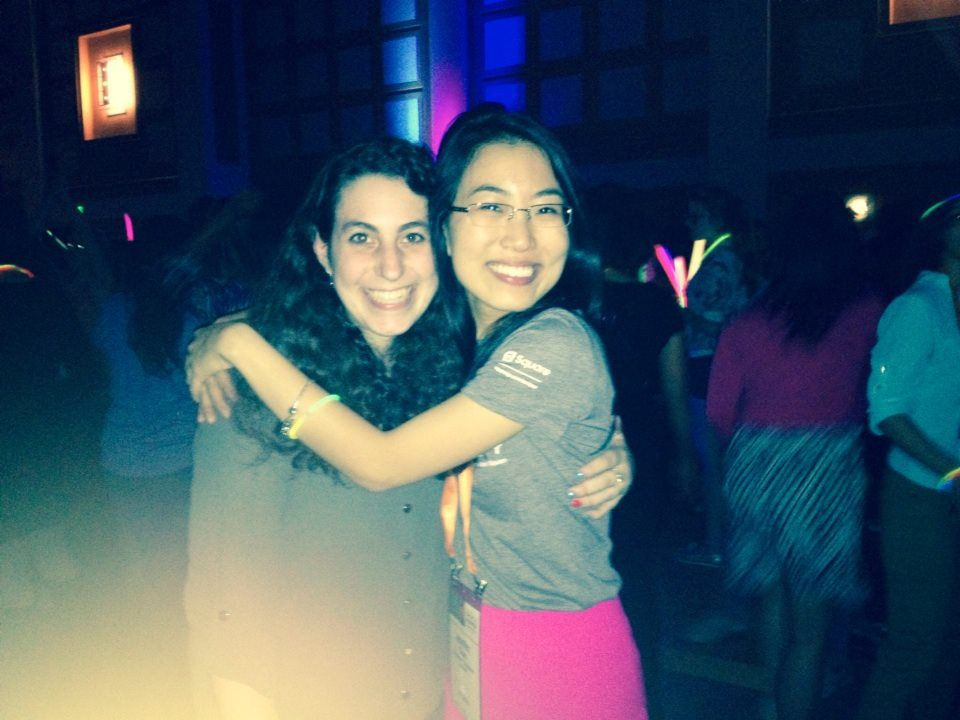

The ACM-W chapter at RPI is proud to be supported by:
- [The NCWIT Student Seed Fund gift sponsored by Symantec](http://www.cs.rpi.edu/~acm-w/summer%202015/ncwit-student-seed-fund.html)
- [Professor Petros Drineas](http://www.cs.rpi.edu/~drinep/)
- [Professor Stacy Patterson](http://www.cs.rpi.edu/~pattes3/)

We are always looking for more ways to support the women in our community.
If you are interested in working with us please contact Sarabeth Jaffe at jaffes2[at]rpi.edu.

GHC 2013 After Party.

